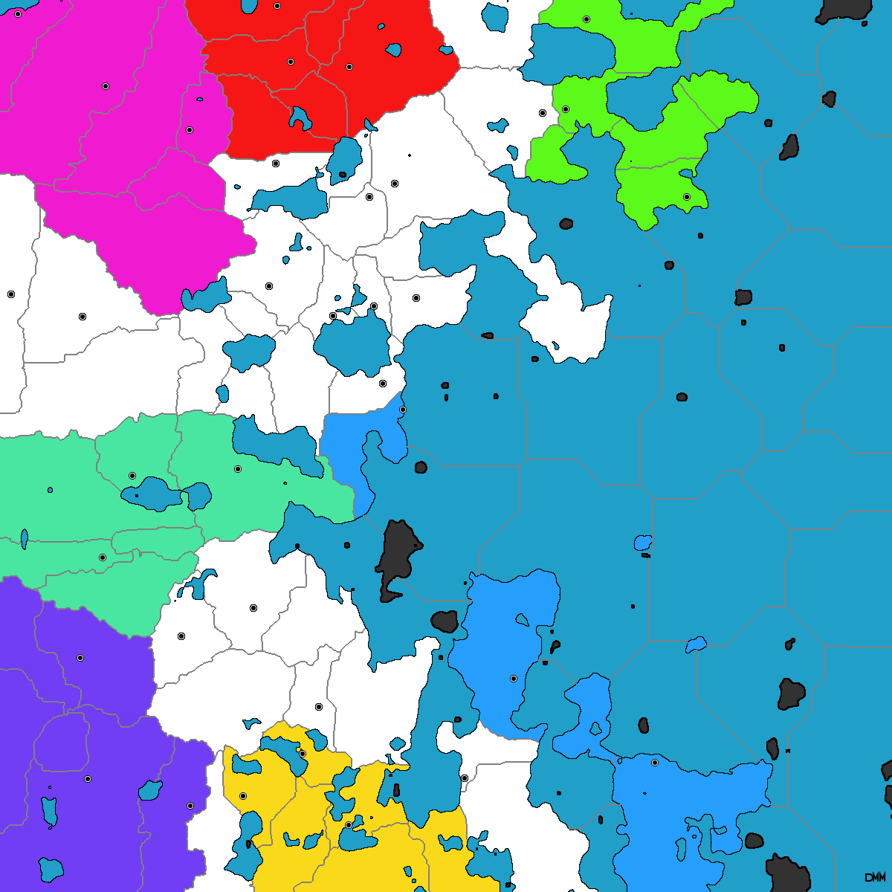

# DiplomacyMapGenerator

Map Generation for Diplomacy Board Game

* Customize the number of players, number of starting supply centers
* Customize terrain generation with preset filters for adjusting perlin noise
* Some balance towards fairness but not a ton

Demo: [Diplomacy Map ProcGen by mcoirad -p5.js Web Editor](https://editor.p5js.org/mcoirad/full/om-x0gXQF)

