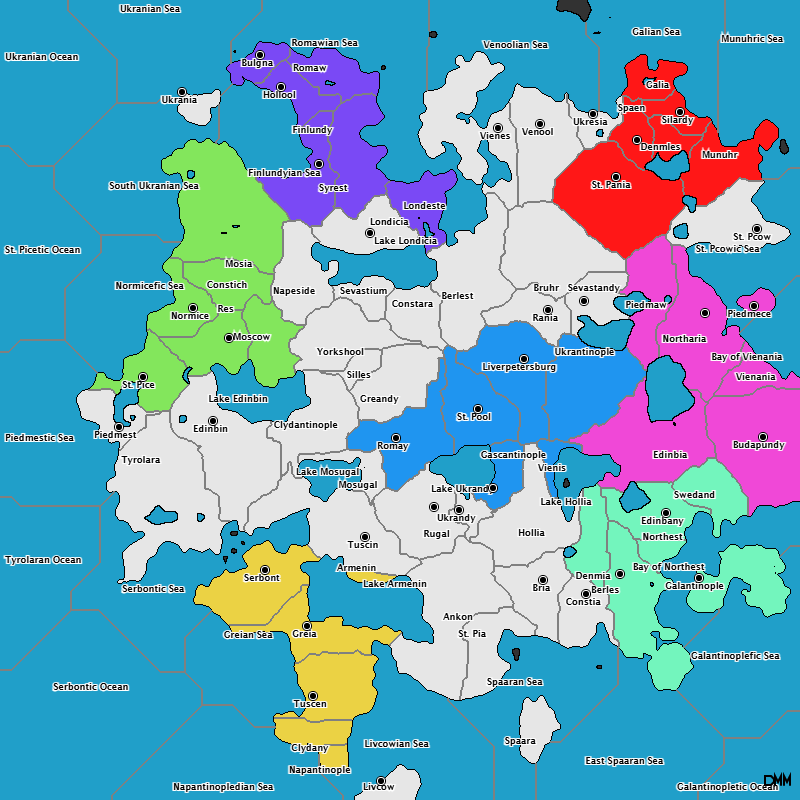

# DiplomacyMapGenerator

Random Map Generation for Diplomacy Board Game

* Customize the number of players, number of starting supply centers, neutral supply center density, fleet density etc.
* Customize terrain generation with 20+ preset map types that filter perlin noise various ways
* Even create a map based off of an existing image with image upload
* Balancing features such as guarantees to water access, boost central players etc.
* WebDip compatible variant exporter
* Map sizes as big as your computer can handle

Demo: [Diplomacy Map ProcGen by mcoirad -p5.js Web Editor](https://editor.p5js.org/mcoirad/full/NxyGxcgZK   )

